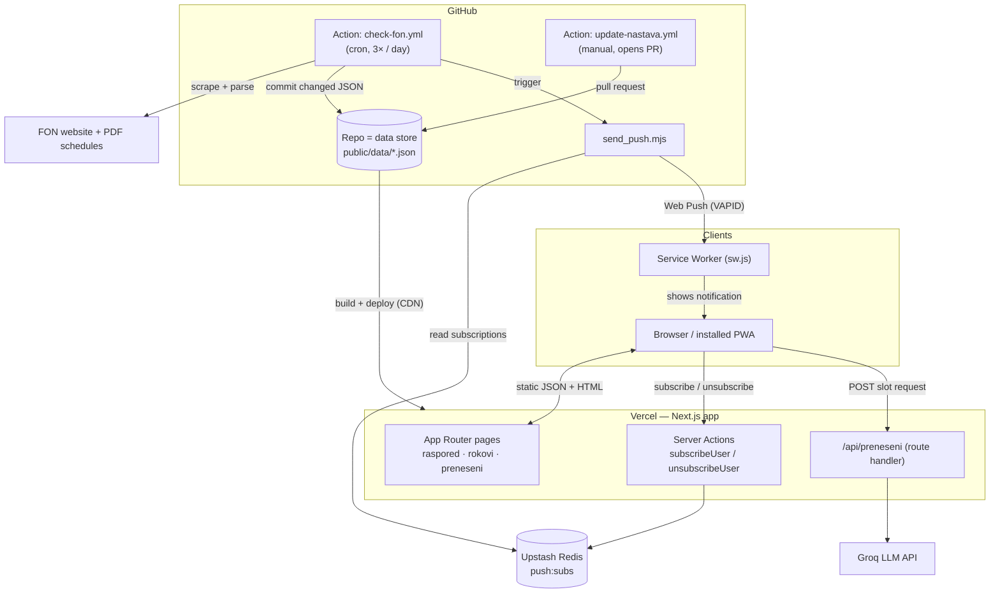
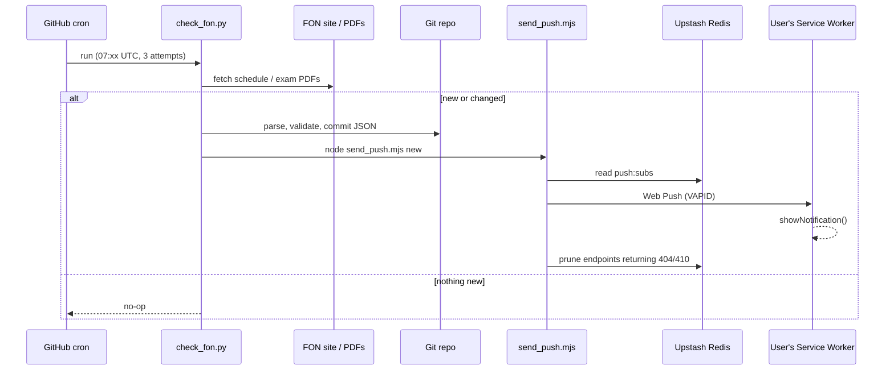
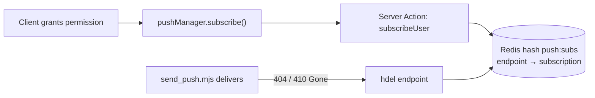

# Architecture

FON Raspored is a PWA that gives students at the Faculty of Organizational
Sciences (Belgrade) a personalized class schedule, exam dates (*rokovi*), and
push reminders. This document describes how the system is put together and, more
importantly, **why** — the design decisions and their trade-offs.

For setup, environment variables, and features, see the [README](README.md).

---

## 1. The shape of the system

The product is read-heavy (thousands of students read the same schedule) and the
underlying data changes rarely (~4 times a year, plus exam dates during exam
season). That single observation drives most of the architecture: the schedule
is **precomputed into static JSON, versioned in Git, and served from a CDN**.
There is no application database. The only stateful backend is a Redis store for
push subscriptions.

---

## 2. Components

| Layer | Tech | Responsibility |
|-------|------|----------------|
| **Frontend** | Next.js 16 (App Router, Turbopack), React 19, TypeScript, Tailwind 4 | Schedule/exam UI, offline-capable PWA, client-side personalization |
| **Client state** | `localStorage` / `sessionStorage` via `lib/storage.ts` | Identity (group/year/program), subject selection, hidden slots, notes — no account required |
| **Data store** | Static JSON in `public/data/` versioned in Git | Per-year schedule (`{year}god.json`), exam dates (`rokovi.json`), subject metadata (`subjects-meta.json`) |
| **Ingestion pipeline** | Python (`check_fon.py`, `fon_parser`, `update_nastava.py`) run in GitHub Actions | Scrape FON PDFs/pages → parse → validate → commit JSON |
| **Notifications** | Web Push (VAPID) + Service Worker + `send_push.mjs` + Upstash Redis | Subscribe on the client, fan-out delivery from CI, prune dead endpoints |
| **AI helper** | `/api/preneseni` → Groq (LLM) | Recommends the best lecture/lab slots for a carried-over course under strict constraints |
| **CI/CD** | GitHub Actions (`ci.yml`) + Vercel | Lint, typecheck, unit tests (Vitest + pytest), build, deploy |

---

## 3. Key data flows

### 3.1 Ingestion → notification (the pipeline)

A scheduled job checks FON for new/changed schedules and exam dates. When
something changes, it commits the new JSON (which triggers a Vercel redeploy) and
pushes a notification to subscribers. GitHub Actions is used as **both the
scheduler and the worker**.

The cron runs three times (`7 8,9,10 * * *`) because GitHub's scheduler is
best-effort and often skips or delays runs on the hour; a dedup guard in
`send_push.mjs` prevents duplicate notifications across the retries.

### 3.2 Push subscription lifecycle

Subscriptions are keyed by their endpoint (a natural unique key per
device/browser), so re-subscribing is idempotent. The sender is the only place
that discovers a dead subscription, so pruning happens there.

### 3.3 Stateless schedule sharing

A shared schedule is encoded entirely into the URL (`base64url` payload:
year, group, subject count, selected indices) — no backend row, no ID to store.
The `/deli` route decodes it, guards against schedule drift (subject count
mismatch), and applies it to local storage. See `lib/share.ts`.

### 3.4 AI slot recommendation

When a student carries a course from a previous year, `/api/preneseni` builds a
tightly constrained prompt (the model may only pick from the exact slots
provided, must avoid gaps, then prefer certain times) and calls Groq. The
constraints live in the prompt and the candidate list is pre-filtered
server-side, so the model ranks rather than invents.

---

## 4. Architecture decision records

### ADR-1 — Git + static JSON as the data store (no database)
**Context:** the schedule is read by many, written ~4×/year by one automated job.
**Decision:** precompute the schedule into JSON committed to the repo; serve it
as static assets over Vercel's CDN.
**Consequences:** essentially free reads, infinite horizontal scale on the read
path, every data change is a reviewable diff with full history, trivial rollback
(`git revert`). Trade-off: writes are coarse (a whole-file commit + redeploy) and
there is no per-record query layer — acceptable because the client loads one
small JSON file and filters in memory.

### ADR-2 — GitHub Actions as scheduler *and* worker
**Context:** ingestion needs a cron and a place to run Python scraping.
**Decision:** use scheduled Actions to scrape, parse, commit, and trigger push,
instead of standing up a dedicated backend/queue/cron service.
**Consequences:** zero extra infrastructure, secrets managed in one place, logs
and run history for free. Trade-off: GitHub cron is best-effort (mitigated with
3 daily attempts + dedup) and a run is a single sequential process (fine at
current scale; see §5).

### ADR-3 — Client-side identity, no accounts
**Context:** a student only needs *their* schedule on *their* device.
**Decision:** keep identity and personalization in `localStorage`/`sessionStorage`
behind a typed façade (`lib/storage.ts`); no sign-up, no user table.
**Consequences:** zero PII stored server-side, no auth surface to secure, instant
onboarding. Trade-off: no cross-device sync and state is per-browser (notably,
an installed iOS PWA has separate storage from Safari — handled by a
"paste your link" onboarding step).

### ADR-4 — Stateless share links
**Context:** sharing a schedule shouldn't require persistence.
**Decision:** encode the whole share payload into the URL (`base64url`).
**Consequences:** no storage, no expiry job, no share-id collisions; links work
forever offline. Trade-off: payload is visible in the URL and can go stale if the
schedule changes — mitigated by a drift check on `/deli`.

### ADR-5 — Upstash Redis, only for push subscriptions
**Context:** the *one* thing that must persist server-side is who to notify.
**Decision:** store subscriptions in a serverless Redis hash keyed by endpoint;
reach it over HTTP from both Server Actions and the CI sender.
**Consequences:** HTTP access works from edge functions and Actions alike,
idempotent upserts, O(1) delete on prune. Trade-off: a second managed dependency,
but scoped to a single tiny concern.

### ADR-6 — Web Push (VAPID) over email/SMS/native
**Context:** reminders should reach an installed PWA on Android, desktop, and iOS.
**Decision:** standards-based Web Push with VAPID; the Service Worker renders the
notification and routes clicks.
**Consequences:** no per-message cost, no phone numbers, works from the installed
app. Trade-off: iOS only supports Web Push from an installed PWA (16.4+), which
shaped the install/onboarding UX.

### ADR-7 — LLM as a constrained ranker, not a source of truth
**Context:** picking non-overlapping carried-over slots is a fiddly optimization.
**Decision:** pre-filter valid candidates server-side and ask the model to *rank*
within an explicit rule set, returning a fixed format.
**Consequences:** the model can't hallucinate invalid slots (it only sees legal
ones), output is parseable, and the feature degrades gracefully. Trade-off:
dependence on an external LLM for a non-critical convenience feature.

---

## 5. Scaling & reliability notes

Current scale (a single faculty) is comfortably served by the design above. If
usage grew by orders of magnitude, the pressure points and likely evolutions:

- **Push fan-out** is a single sequential pass in one Action runner. At 100k+
  subscribers this becomes the bottleneck → batch sends, parallelize with
  concurrency limits, and/or move delivery to a queue with retry/back-off.
- **Data store** stays static far longer than intuition suggests (reads are CDN
  hits). If per-record queries or partial updates were ever needed, the JSON
  could move to a KV/edge store fronted by ISR without touching the read model.
- **Reliability gaps (known, not yet built):** the scraper can fail silently if
  FON changes its HTML. Planned: schema validation at ingest (quarantine bad
  parses) and a dead-man's-switch alert if no successful scrape lands within N
  days. Delivery metrics (sent / failed / pruned) would make the push pipeline
  observable.

Existing reliability measures: cron redundancy with dedup (§3.1), idempotent
subscription upserts, dead-endpoint pruning (§3.2), TZ-correct date handling
(Europe/Belgrade) independent of the runner's timezone, and CI gating on lint +
typecheck + unit tests (Vitest + pytest) before deploy.
